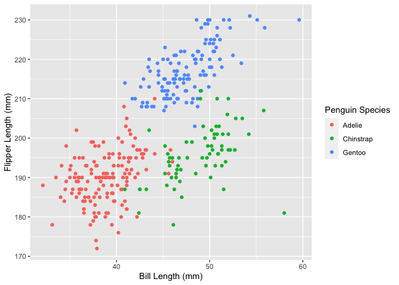

p8105_hw1_rs4390
================
Rae Spriggs
2022-09-17

# Problem 1

``` r
data("penguins", package = "palmerpenguins")
```

## Dataset description

The penguins dataset contains 344 observations of individual penguins.
There are 8 total variables that detail the penguins’ physical
dimensions, sex, year, species, and island.

The penguins in the dataset are from 3 islands (Biscoe, Dream, and
Torgersen), 3 years (2007, 2008, and 2009), and represent 3 species
(Adelie, Chinstrap, and Gentoo). The other variables include: bill
length, bill depth, flipper length, body mass, and sex. The mean flipper
length of the dataset is 201 mm.

## Scatterplot

    ## Warning: Removed 2 rows containing missing values (geom_point).

<!-- -->

    ## Warning: Removed 2 rows containing missing values (geom_point).
